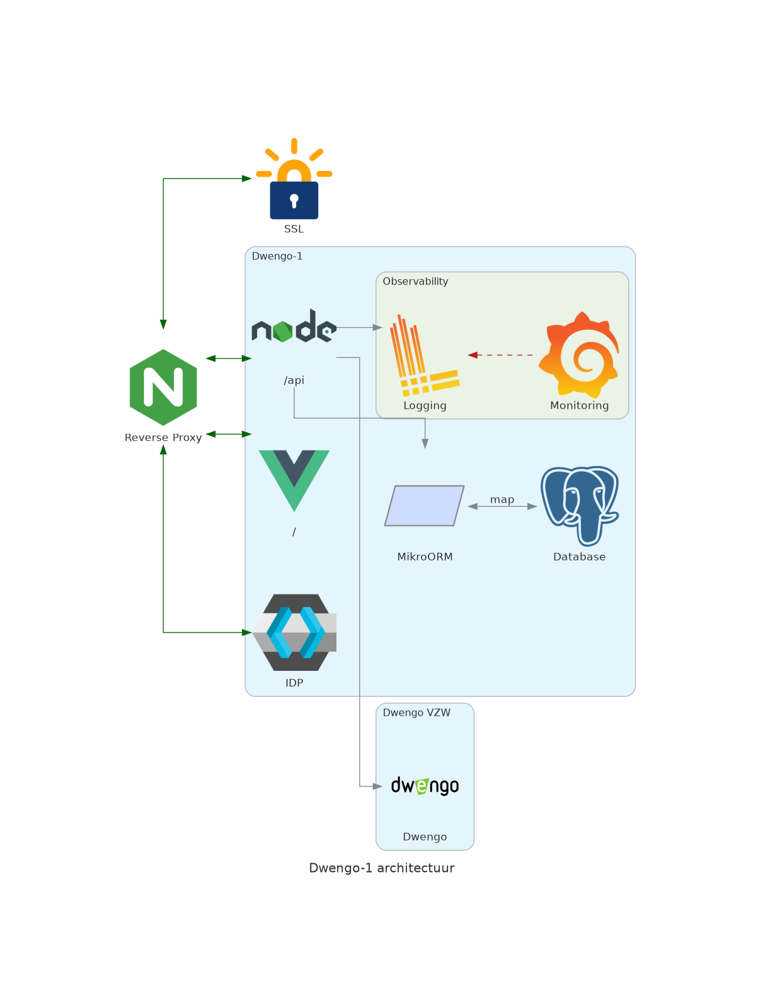

<h1 align="center">Dwengo-1</h1>

<p align="center">
<span><a href="https://ugentbe-my.sharepoint.com/:f:/r/personal/bart_mesuere_ugent_be/Documents/Onderwijs/SELab2/2024-2025/mappen%20studenten/groep1" alt="OneDrive">
OneDrive</a></span>
<span><a href="https://www.figma.com/files/project/339220191" alt="Figma sjabloon">
Figma</a></span>
<span><a href="https://github.com/SELab-2/Dwengo-opgave" alt="projectopgave">
Projectopgave</a></span>
</p>

Dit is de monorepo voor [Dwengo-1](https://sel2-1.ugent.be), een interactief leerplatform waar leerkrachten opdrachten
en lessen kunnen samenstellen hun leerlingen en hun vooruitgang kunnen opvolgen.

## Installatie

Om de applicatie in te stellen voor een productieomgeving, volg
de [installatiehandleiding](https://github.com/SELab-2/Dwengo-1/wiki/Administrator:-Productie-omgeving).

Alternatief kan je één van de volgende methodes gebruiken om de applicatie lokaal te draaien.

### Quick start

Om de applicatie lokaal te draaien als kant-en-klare Docker-containers:

1. Installeer Docker en Docker Compose op je systeem (zie [Docker](https://docs.docker.com/get-docker/)
   en [Docker Compose](https://docs.docker.com/compose/)).
2. Clone deze repository.
3. In de backend, kopieer `.env.example` naar `.env` en pas de variabelen aan waar nodig.
4. Voer `docker compose -f compose.staging.yml up --build` uit in de root van de repository.
5. Optioneel: Configureer de applicatie aan de hand van
   de [configuratiehandleiding](https://github.com/SELab-2/Dwengo-1/wiki/Administrator:-Productie-omgeving#dwengo-1-configuratie).
6. De applicatie is nu beschikbaar op [`http://localhost/`](http://localhost/) en [`http://localhost/api`](http://localhost/api).

```bash
docker compose version
git clone https://github.com/SELab-2/Dwengo-1.git
docker compose -f compose.staging.yml up --build
# Gebruikt backend/.env.staging
```

### Handmatige installatie en ontwikkeling

Zie de submappen voor de installatie-instructies van de [frontend](./frontend/README.md)
en [backend](./backend/README.md) en instructies voor het opzetten van een ontwikkelomgeving.

## Architectuur



De tech-stack bestaat uit:

- **Frontend**: TypeScript + Vue.js + Vuetify
- **Backend**: TypeScript + Node.js + Express.js + TypeORM + PostgreSQL
- **Identity provider**: Keycloak

Voor meer informatie over de keuze van deze tech-stack,
zie [designkeuzes](https://github.com/SELab-2/Dwengo-1/wiki/Developer:-Design-keuzes).

## Testen

Voer volgende commando's uit om de <frontend/backend> te testen:

```
npm run test:unit
```

## Bijdragen aan Dwengo-1

Zie [CONTRIBUTING.md](./CONTRIBUTING.md) voor meer informatie over hoe je kan bijdragen aan Dwengo-1.

Deze rocksterren hebben bijgedragen aan Dwengo-1:

| Naam                                                                                                                                                    | Functie                    |
| ------------------------------------------------------------------------------------------------------------------------------------------------------- | -------------------------- |
| [<br/><sub><b>Adriaan Jacquet</b></sub>](https://github.com/WhisperinCheetah)         | Backend Lead               |
| [<br/><sub><b>Francisco Gabriel Van Langenhove</b></sub>](https://github.com/Gabriellvl)    | Team Lead                  |
| [<br/><sub><b>Gerald Schmittinger</b></sub>](https://github.com/geraldschmittinger) | Database Administrator     |
| [<br/><sub><b>Joyelle Ndagijimana</b></sub>](https://github.com/joyelle436)                 | Frontend Lead              |
| [<br><sub><b>Laure Jablonski</b></sub>](https://github.com/laurejablonski)              | Documentatie- en Test Lead |
| [<br/><sub><b>Tibo De Peuter</b></sub>](https://github.com/tdpeuter)                          | Technische Lead            |
| [<br/><sub><b>Timo De Meyst</b></sub>](https://github.com/kloep1)                               | System Administrator       |

En in de toekomst misschien jij ook?
